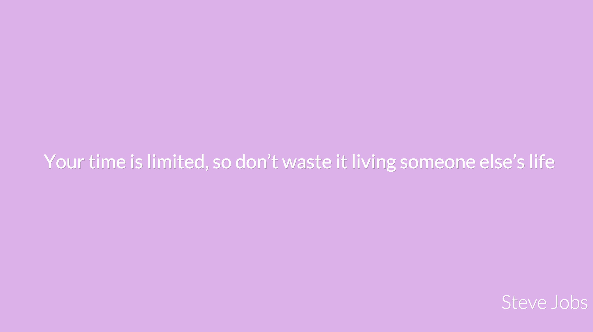
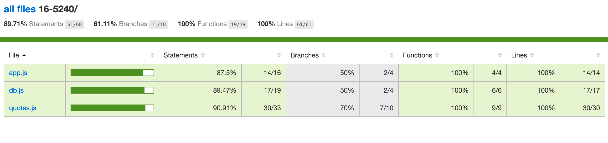

# Assignment 1

## Objective

Demonstrate your mastery of:

- running nodejs
- setting up a mongodb database
- using express
- connecting to the database
- responding with a file
- responding with JSON
- node module syntax (require/export) using the module design pattern
- npm
- testing your code
    - unit
    - end to end
- some html
- some css
- jquery or just javacript in the browser
- ajax


## Requires

- Internet
- Google chrome
- A plain text editor (preferably sublime)
- mongodb
- nodejs
- git
- A github account

## Motivation

We feel SE students will go through harsh trials in the near future, accordingly we thought of having you build an inspirational quote app. May it lift your spirit in your time of need.

## Task

You are to __fork__ this repository and submit a pull request when you are done

Your job is to create a simple test driven inspirational quotes application that will show you a new inspirational quote every-time you click on the page as well as the author of the quote in the bottom right, the quote should be loaded using ajax.

The application should inform the user somehow on how he can use it, in my case I made it so that the first time the app starts it says on the screen that you should click/tap

__A demo that will only work in chrome and basically just looks like what we want you to do can be found [here](http://amrdraz.github.io/inspire-me/)__

> If you want to have fun you can modify the data we give you and create your own set of quotes - for example make it an Arabic movie quotes app.

### UI




### File structure

After you  __fork__ the assignment repo, add your own folder with your id.

You should minimally windup with the following structure.

```
|- 16-5240/
|  |- public/
|  |  |- js/
|  |  |  |- jquery.min.js  <------ you can optionally not use this.
|  |  |  |- main.js        <------ your javascript file
|  |  |  
|  |  |- css/
|  |  |  |- style.css
|  |  |  
|  |  |- index.html 
|  |
|  |- test/
|  |  |- quote.js          <------ see how kind we are bellow
|  |
|  |- app.js
|  |- server.js
|  |- quotes.js
|  |- db.js                <------ this is partially provided, love us
|  |- package.json
|  
|- quotes.json
|- .gitignore
|- README.md
```

You will find in this repo the `.gitignore` and `quotes.json` files everything else you have to create yourself.

- `public/js/` Should contain your javascript files.
- `public/css/` Should contain your css files.
- `public/index.html` Should contain the html
- `app.js` contains code that handles the routes and exports the express app.
- `server.js` contains code that runs the app.
- `/quotes.js` should contain the functionality related to quotes
- `test/quotes.js` should contain the tests that make sure all functionality in the quotes.js file work.
- `db.js` In my example this is a file that hold functions for connecting and accessing the database.
- `package.json` should contain all your dependencies in addition to your npm scripts; start, test, and coverage.
    - the start script runs the database.
    - the test script runs the mocha tests.
    - the coverage script runs istanbul.

### Features

- The app must serve the data from a mongodb database.
- The app should implement a simple GET API for getting quotes.
- quotes.js should impliment the functions bellow

#### quotes.js

Export the following functions

##### `getElementByIndexElseRandom(array [, index])` 

- Given an array returns:
    - A random element from the array If index is not passed.
    - The element in the correct index position if it is.

```js
getElementByIndexElseRandom([1, 3, 4])    // any of 1 3 or 4
getElementByIndexElseRandom([1, 3, 4], 0) // always 1
```


##### `getQuotesFromJSON()`

- returns all the quotes as JSON
    
```js
getQuotesFromJSON() // basically returns the whole object.
```

##### `getQuoteFromJSON([index])`

- returns a random quote from the quotes.json file if index is not passed else the on int the index position.

```js
getQuoteFromJSON()           // any of quote object in the quotes.json file
getQuoteFromJSON(0).author   // Kevin Kruse
```

##### `seed(cb)`

Populate the database with quotes from quotes.json, seed should call the call back when done with an `error, seeded` set of arguments.

seeded is a boolean value that is true if the database was empty (and thus seeded) or no error occurred but the database already contains records.

```js
seed(function (err, seeded) {
    // seeded is true when quotes are added to the database
    // seeded is false when nothing is added to the db
})
```


##### `getQuotesFromDB(cb)`

- Will call the callback function passed __cb__ with arguments `error, quotes`
    - error will be null if no error occurred
    - quotes is a list of all quotes
    
```js
getQuotesFromDB(function (err, quotes) {
    // any of quote object in the database  
})
```

##### `getQuoteFromDB(cb [, index])`

- Will call the callback function passed __cb__ with arguments `error, quote`
    - error will be null if no error occurred
    - quote should contain a random quote document returned from the database
- Optional argument index if present will select a specific quote by index from the quotes documents returned.

```js
getQuoteFromDB(function (err, quote) {
    // any of quote object in the database  
})
getQuoteFromDB(function (err, quote) {
    // is Kevin Kruse assuming it's the first document in the database
    quote.author;  
}, 0)
```


#### db.js

##### `connect(cb)`
Connects to database then call callback passing db.

##### `db()`
Returns the instantiated db object.

##### `clearDb(cb)`
Clears the database used largely in testing. then call callback.

#### API

The server needs to serve index.html when we visit `/index.html`, `index`, or just `/`. Any other url not supported should return a 404 not found.

The following API route endpoint should exist.


##### `/api/quote`

returns a JSON response that was randomly selected from the database

The response should look like this which is basically what you will get from querying the document in mongodb.

```json
{
    "quote": {
        "_id": "theobjectidoftherecord",
        "text": "Nothing Comes to those who wait",
        "author": "Amr Draz"
    }
}
```

#### `/api/quotes`

returns a JSON array as response containing all quotes in the database.

```js
[
    {
        "quote": {
            "_id": "theobjectidoftherecord",
            "text": "Nothing Comes to those who wait",
            "author": "Amr Draz"
        }
    },
    ....
]
```

### Front End requirement

When a user clicks on the page on index.html; a script should send a `GET` request  to `/api/quote`, returning a random quote form the database as JSON, which in turn is then used to update the html page.


### Test Requirements

You need to write tests as well as run a coverage test on your app to know it is working.

We will run our tests against your project as well as your tests against our project, see test file bellow.

We will run the coverage test using the istanbul npm package.

You should achieve a coverage level that looks like this.



You can find this html file in a folder called coverage after you run instanbul.


### Some Hint and Suggestions


#### Strategy

As a development strategy I encourage you to build the project following the order in the test file bellow.

First without the database and server then think about connecting to the database then do the server then build the front end that connects to it.

#### Other Hints

- You will need to add your dependencies in package.json

- For this assignment you will as a minimum use the npm packages
    - mocha - for testing
    - supertest - for testing the api
    - chai - for assertion
    - istanbul - for coverage
    - express - for managing your api
    - mongodb - for connecting to the database.

- You can look up the documentation of each of these modules and how to use them on your own.

- You don't need to declare a rout for each resource in express you can simply declare a static file directory to server your public folder.

> The quote test should test all functions in quote.js

To test the random selection you can assert that the returned quote is included in one of the quotes you can get from getQuotesFromJSON or when testing the db from getQuotesFromDB

You can read a json file using require `require('../quotes.js')` here I'm assuming quotes.json is one directory up

You will need to clear the database before you run the seed test, you can do this by calling `before(db.clearDB)` which is provided by us.

This should be your db.js file

```js
// db.js
var mongo = require('mongodb').MongoClient;
var DB = null;
var dbURL = 'mongodb://localhost:27017/inspire-me';

/**
 * function that connects to the mongodb instance initialized.
 * @param  {Function} cb callback for when connection is complete
 */
exports.connect = function(cb) {
    // You do this one
};

/**
 * used to get access to the db object to query the database
 * throws an error if db not initialized.
 * example use case assuming you required the module as db
 *     db.db().find(.... etc
 * @return {MongoDBObject} 
 */
exports.db = function() {
    if (DB === null) throw Error('DB Object has not yet been initialized');
    return DB;
};

/**
 * clears all collections in the database calling the callback when done
 * @param  {Function} done callback indicating the operation is complete
 */
exports.clearDB = function(done) {
    DB.listCollections().toArray().then(function (collections) {
        collections.forEach(function (c) {
            DB.collection(c.name).removeMany();   
        });
        done();
    }).catch(done);
};
```

This is how your tests/quotes.js should look like

```js
// tests/quotes.js

var assert = require('chai').assert;
var app = require('../app.js');
var request = require('supertest');
var Quote = require('../quotes.js');
var db = require('../db.js');

before(function(done) {
    // use this after you have completed the connect function
    // db.connect(function(err, db) {
    //    if (err) return done(err);
    //    else done();
    // });
});

describe("getElementByIndexElseRandom", function() {
    var arr = [1, 2, 3, 43, 5];
    it("should return a random element that is included in the array if we omit the index", function() {
        // TODO
    });
    it("should return the first element if we also pass the index 0", function() {
        // TODO
    });
    it("should return the last element if we also pass the index", function() {
        // TODO
    });
});

describe("getQuotesFromJSON", function() {
    it("should return an array of 102 quote", function() {
        // TODO: you know how many quotes are there
    });
    it("first quote in the array's author should be Kevin Kruse", function() {
        // TODO: you know the content of first quote
    });
});

describe("getQuoteFromJSON", function() {
    it('should return a quote object with an author and text property', function() {
        // TODO: check that the returned quote has text and author
    });
    it('should return a random quote if index not specified', function() {
       // TODO: is the returned quote in the all quotes array?
    });
    it('should return the first quote if we pass 0', function() {
        // TODO: you know the content of first quote
    });
});

// quotes collection should be called quotes
describe('seed', function() {
    before(db.clearDB);
    it('should populate the db if db is empty returning true', function(done) {
        // TODO: assert that seeded is true
    });
    it('should have populated the quotes collection with 102 document', function(done) {
        // TODO: check that the database contains 102 document
    });
    it('should not seed db again if db is not empty returning false in the callback', function(done) {
        // TODO: assert that seeded is false
    });
    it('should not seed db again if db is not empty', function(done) {
        // TODO: The database should have 102 quote still
    });
});

describe('getQuotesFromDB', function() {
    it('should return all quote documents in the database', function(done) {
        // TODO: there should be 102 documents in the db
    });
});

describe('getQuoteFromDB', function() {
    it('should return a random quote document', function(done) {
        // TODO: see if it returns on of the quotes from all quotes
    });
    it('should return the first quote if passed 0 after callback', function(done) {
        // TODO: you know the content of object in the file
    });
});

describe('API', function() {
    request = request(app);
    it("should return a 404 for urls that don't exist", function(done) {
        // TODO: test with supertest
    });

    it('/api/quote should return a quote JSON object with keys [_id, text, author]', function(done) {
        // TODO: test with supertest
    });

    it('/api/quotes should return an array of JSON object when I visit', function(done) {
        // TODO: test with supertest
    });
});

```


### Meta

The assignment is worth 3% of your project grade
It is individual
Deadline Sunday the 28th of Feb
